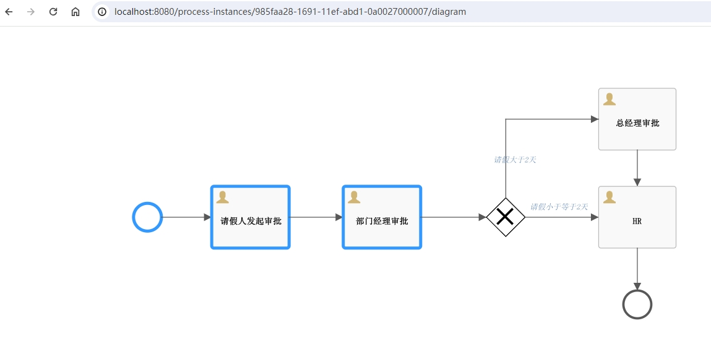

## springboot3 + activiti 8

### 环境说明
* jdk 21
* springboot 3.2.4
* activiti的版本不能用8.2，8.2版本的org/activiti/db/create/activiti.mysql.create.history.sql脚本里面表ACT_HI_IDENTITYLINK类型为`DETAILS_ varbinary(max),`, 8.3、8.4版本都没问题字段类型为：`DETAILS_ LONGBLOB,`
* 正常启动会创建25张表

### 说明

* activiti7开始默认整合了spring security，需要配置，否则报错
  * 若报错又手动添加UserDetailsService的bean，可以手动引入spring-boot-starter-security依赖
    * pom配置
    ```xml
    <dependency>
          <groupId>org.activiti</groupId>
          <artifactId>activiti-spring-boot-starter</artifactId>
          <version>8.4.0</version>
      </dependency>

      <dependency>
          <groupId>org.springframework.boot</groupId>
          <artifactId>spring-boot-starter-security</artifactId>
      </dependency>
    ```
    * 启动类排除
    > 默认会自动装配spring security，若不想自动装配，可以进行排除，接口不会被拦截
    ```java
    @SpringBootApplication(exclude = {SecurityAutoConfiguration.class, ManagementWebSecurityAutoConfiguration.class})
    ```
* 查看流程图
    * 需要依赖
    ```xml
    <dependency>
        <groupId>org.activiti</groupId>
        <artifactId>activiti-image-generator</artifactId>
        <version>8.4.0</version>
    </dependency>
    ```
    * http://localhost:8080/process-instances/78f3a127-167d-11ef-947a-0a0027000007/diagram
      