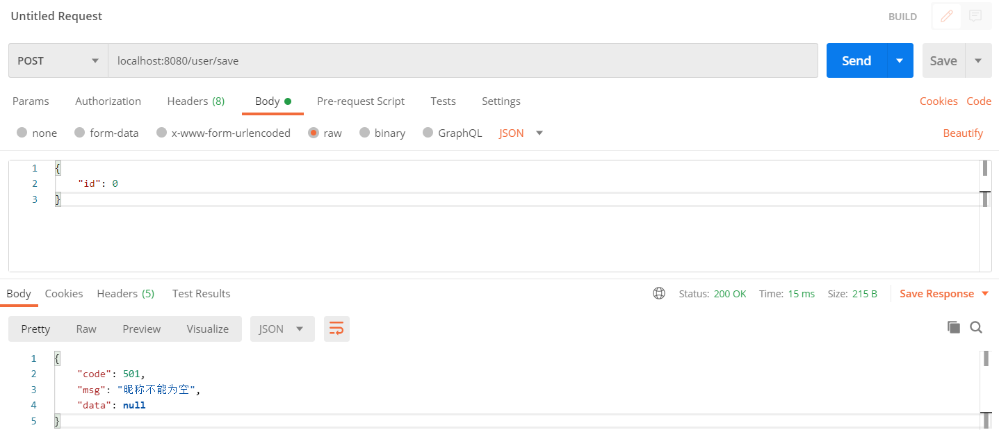
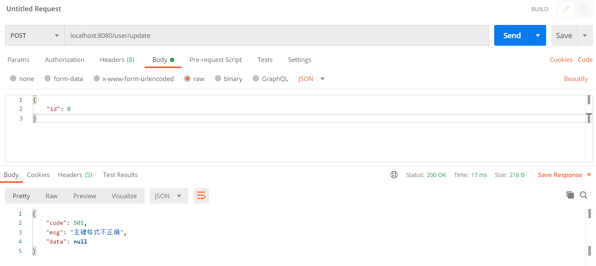

# Springboot JSR303(validation)数据校验

##### 引入依赖

> `springboot从2.3`版本开始已经移除了`spring-boot-starter-web`中的`hibernate-validator`依赖， [参考](https://blog.csdn.net/not_say/article/details/107366789)
    
* 引用依赖也最好用`spring-boot-starter-validation`这种`starter`方式，减少依赖冲突

```xml
<dependency>
    <groupId>org.springframework.boot</groupId>
    <artifactId>spring-boot-starter-validation</artifactId>
</dependency>
```

##### 创建两个`interface`用来区分`insert`和`update`操作，不需要实现

> 分组的作用：当新增和修改用同一个类的时候，若只想要某个字段在修改时才必传，新增时可不传，可以用分组实现

```java
package com.jonny.springbootjsr303.validation;

/**
 *  插入组
 */
public interface Insert {
}


/**
 *  更新组
 */
public interface Update {
}
```

##### 创建实体类

```java
package com.jonny.springbootjsr303.form;

import com.jonny.springbootjsr303.validation.Insert;
import com.jonny.springbootjsr303.validation.Update;
import lombok.Data;
import lombok.experimental.Accessors;

import javax.validation.constraints.Min;
import javax.validation.constraints.NotEmpty;
import javax.validation.constraints.NotNull;

@Data
@Accessors(chain = true)
public class UserAddOrUpdateForm {

    @Min(value = 1, message = "主键格式不正确", groups = Update.class)
    @NotNull(message = "主键不能为空", groups = Update.class)
    private Long id;

    @NotEmpty(message = "用户名", groups = Insert.class)
    private String username;

    @NotEmpty(message = "昵称不能为空", groups = Insert.class)
    private String nickname;

    private String email;

}
```

##### 控制器

* Java版

```java
package com.jonny.springbootjsr303.controller;

import com.jonny.springbootjsr303.form.UserAddOrUpdateForm;
import com.jonny.springbootjsr303.validation.Insert;
import com.jonny.springbootjsr303.validation.Update;
import org.springframework.validation.annotation.Validated;
import org.springframework.web.bind.annotation.PostMapping;
import org.springframework.web.bind.annotation.RequestBody;
import org.springframework.web.bind.annotation.RequestMapping;
import org.springframework.web.bind.annotation.RestController;

@RestController
@RequestMapping("/user1")
public class User1Controller {

    @PostMapping("/save")
    public UserAddOrUpdateForm save(@Validated(Insert.class) @RequestBody UserAddOrUpdateForm form) {
        return form;
    }

    @PostMapping("/update")
    public UserAddOrUpdateForm update(@Validated({Update.class}) @RequestBody UserAddOrUpdateForm form) {
        return form;
    }
}
```

* Groovy版

```java
package com.jonny.springbootjsr303.controller

import com.jonny.springbootjsr303.form.UserAddOrUpdateForm
import com.jonny.springbootjsr303.validation.Insert
import com.jonny.springbootjsr303.validation.Update
import org.springframework.validation.annotation.Validated
import org.springframework.web.bind.annotation.PostMapping
import org.springframework.web.bind.annotation.RequestBody
import org.springframework.web.bind.annotation.RequestMapping
import org.springframework.web.bind.annotation.RestController

@RestController
@RequestMapping("/user")
class UserController {

    @PostMapping("/save")
    UserAddOrUpdateForm save(@Validated([Insert.class]) @RequestBody UserAddOrUpdateForm form) {
        return form
    }

    @PostMapping("/update")
    UserAddOrUpdateForm update(@Validated([Update.class, Insert.class]) @RequestBody UserAddOrUpdateForm form) {
        return form
    }
}
```

##### 全局异常捕获

```java
package com.jonny.springbootjsr303.exception;

import com.jonny.springbootjsr303.base.Result;
import org.springframework.validation.FieldError;
import org.springframework.web.bind.MethodArgumentNotValidException;
import org.springframework.web.bind.annotation.ExceptionHandler;
import org.springframework.web.bind.annotation.RestControllerAdvice;

import java.util.List;

@RestControllerAdvice
public class GlobalExceptionHandler {

    @ExceptionHandler(value = Exception.class)
    public Result exceptionHandler(Exception e){
        if (e instanceof MethodArgumentNotValidException){
            MethodArgumentNotValidException ex = (MethodArgumentNotValidException) e;
            List<FieldError> fieldErrors = ex.getBindingResult().getFieldErrors();
            //多个错误，取第一个
            FieldError error = fieldErrors.get(0);
            String msg = error.getDefaultMessage();
            return Result.validError(msg);
        }else {
            return Result.error(e.getMessage());
        }
    }
}
```


## 踩坑

* No.1
```bash
Groovyc: Annotation list attributes must use Groovy notation [el1, el2] in @org.springframework.validation.annotation.Validated
```

> 原因分析: `UserController`类我用的Groovy类，`{}`在Groovy有特殊用途，是作为闭包的，所以不能用下面这种方式

```groovy
@PostMapping("/update")
UserAddOrUpdateForm update(@Validated({Update.class}) @RequestBody UserAddOrUpdateForm form) {
    return form
}
```

换成下面这种

```groovy
@PostMapping("/update")
UserAddOrUpdateForm update(@Validated(Update.class) @RequestBody UserAddOrUpdateForm form) {
    return form
}
//或者
@PostMapping("/update")
UserAddOrUpdateForm update1(@Validated([Update.class]) @RequestBody UserAddOrUpdateForm form) {
    return form
}
```

* `@Validated`注解无效
    * 实体类没被扫描到，之前把@Valid注解加到interface方法上，死活不生效
      * 注解可以加到interface，但是需要保证它能被扫描到
    * `@Validated(Update.class)`注解分组和实体类没对上，可能没加分组等
  

##### 效果图




