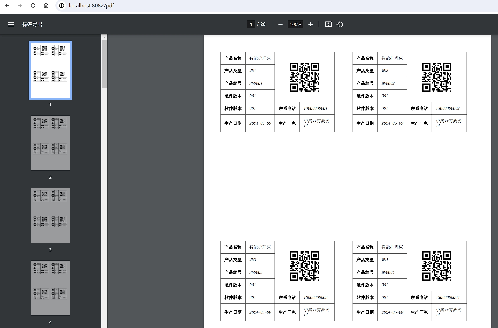

## SpringBoot + freemarker + openhtmltopdf生成pdf

* 访问：[http://localhost:8082/pdf](http://localhost:8082/pdf)

### 核心依赖

```xml
<dependency>
    <groupId>org.freemarker</groupId>
    <artifactId>freemarker</artifactId>
</dependency>
<dependency>
    <groupId>org.springframework.boot</groupId>
    <artifactId>spring-boot-starter-freemarker</artifactId>
</dependency>
<!-- ALWAYS required. -->
<dependency>
    <groupId>com.openhtmltopdf</groupId>
    <artifactId>openhtmltopdf-core</artifactId>
    <version>1.0.0</version>
</dependency>
<!-- Required for PDF output. -->
<dependency>
    <groupId>com.openhtmltopdf</groupId>
    <artifactId>openhtmltopdf-pdfbox</artifactId>
    <version>1.0.0</version>
</dependency>
```

## 字体配置

* application.yml中fontPath（项目下/fonts/simsun.ttf）

## 效果



## 问题

### 字体放到src/main/resources

* 报错
> java.io.FileNotFoundException: class path resource [templates/fonts/simsun.ttf] cannot be resolved to absolute file path because it does not reside in the file system: jar:file:/D:/project/spring-boot-pdf/target/spring-boot-pdf-0.0.1-SNAPSHOT.jar!/BOOT-INF/classes!/templates/fonts/simsun.ttf

* 如何解决？

```java
// 这种方式加载字体文件在本地可以运行，打包jar后获取不到字体，所以将字体存放到本地磁盘，而不是从springboot.jar!/BOOT-INF/classes!/templates/fonts/simsun.ttf读取
// builder.useFont(ResourceUtils.getFile("classpath:templates/fonts/simsun.ttf"), "simsun");
builder.useFont(file, "simsun");
```

### 本地运行不乱码，打包jar运行乱码

* 设置freemarker编码

```java
cfg.setDefaultEncoding(StandardCharsets.UTF_8.name());
```