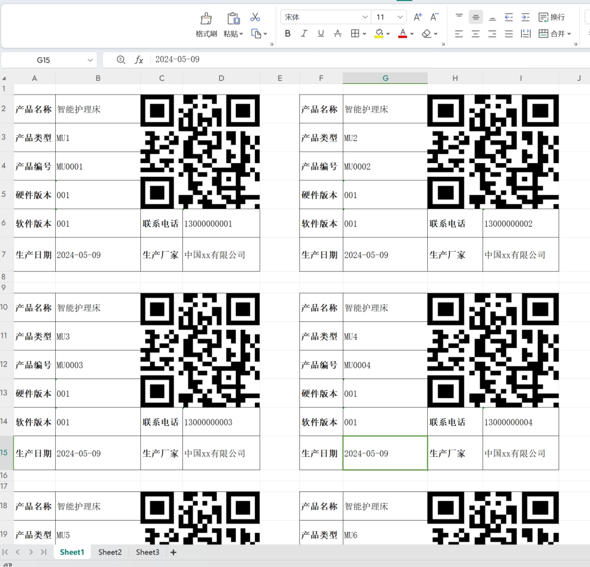

## SpringBoot + jxls2生成excel

### 核心依赖

```xml
<dependency>
    <groupId>org.jxls</groupId>
    <artifactId>jxls</artifactId>
    <version>2.12.0</version>
</dependency>
<dependency>
<groupId>org.jxls</groupId>
<artifactId>jxls-poi</artifactId>
<version>2.12.0</version>
</dependency>
```

## 说明

* 批注可以写多个，但是解析时有顺序
* [官网](https://jxls.sourceforge.net/reference/each_command.html)

* src/main/test/com.exapmle/ExportTest.java 简单文字导出
* src/main/test/com.exapmle/ExportImgTest.java 带图片单列导出
* src/main/test/com.exapmle/ExportImg2Test.java 带图片两列导出
  > 配合jx:if标签判断奇数偶数，展示不同数据
  *  效果图
  

### 设置图片格式

> imageType=”JPEG”，imageType图片类型默认是PNG，支持：PNG, JPEG, EMF, WMF, PICT, DIB

```shell
jx:image(lastCell=”D5” src=”item.qrcodeBytes” imageType=”JPEG”)
```

### 合并单元格

> lastCell为需合并的最后一个单元格位置，rows合并行数，cols合并列数

```shell
jx:mergeCells(lastCell=”D5” rows=”4” cols=”2”)
```