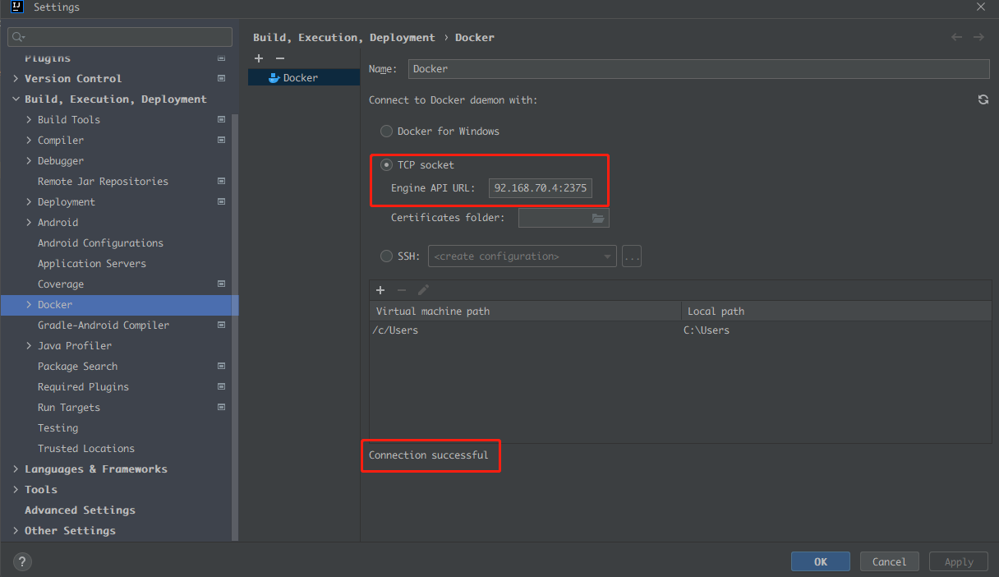
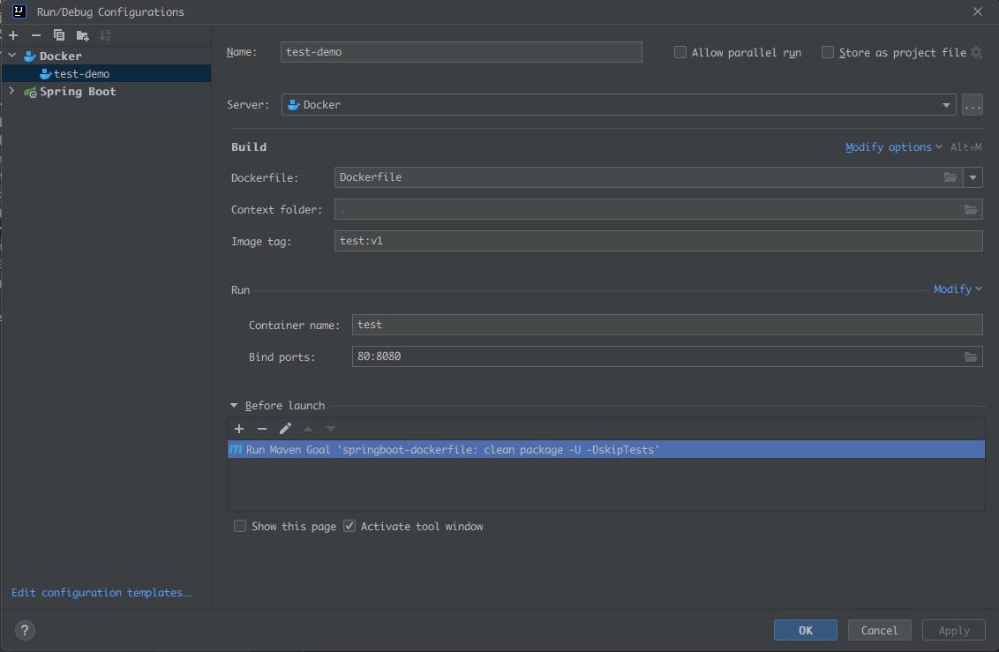

## Docker部署jar

### 1.打开docker服务

* 编辑`/usr/lib/systemd/system/docker.service`
```shell
#vim /usr/lib/systemd/system/docker.service
#将ExecStart=/usr/bin/dockerd -H fd:// --containerd=/run/containerd/containerd.sock修改为如下
ExecStart=/usr/bin/dockerd -H tcp://0.0.0.0:2375 -H fd:// --containerd=/run/containerd/containerd.sock
```

* 重启docker服务
  * systemctl daemon-reload    加载docker守护线程
  * systemctl restart docker   重启docker

### 2.配置idea的docker
> 需要安装docker插件

* 设置地址：tcp://192.168.70.4:2375



### 3.构建Dockerfile

```dockerfile
FROM openjdk:8u201-jdk-alpine3.9
VOLUME /tmp
ENV LANG=C.UTF-8 LC_ALL=C.UTF-8
RUN ln -sf /usr/share/zoneinfo/Asia/Shanghai /etc/localtime && echo 'Asia/Shanghai' > /etc/timezone
EXPOSE 8080
ADD target/springboot-dockerfile-0.0.1-SNAPSHOT.jar app.jar
ENTRYPOINT ["java","-Djava.security.egd=file:/dev/./urandom","-jar","./app.jar","-C"]
```

### 4.创建docker配置

> 配置maven打包命令：clean package -U -DskipTests



### 5.启动会直接发布到服务端


## 问题

### 1.启动报错

> Failed to deploy 'test Dockerfile: Dockerfile': Not connected to docker

* 原因是idea不是以管理员身份启动的，没有权限操作，关闭idea--以管理员身份运行就好了

### 2.启动报错

> iptables failed: iptables --wait -t nat -A DOCKER -p tcp -d 0/0 --dport 8888 -j DNAT --to-destinati

* 重启docker: systemctl restart docker或者关闭防火墙：systemctl stop firewalld.service