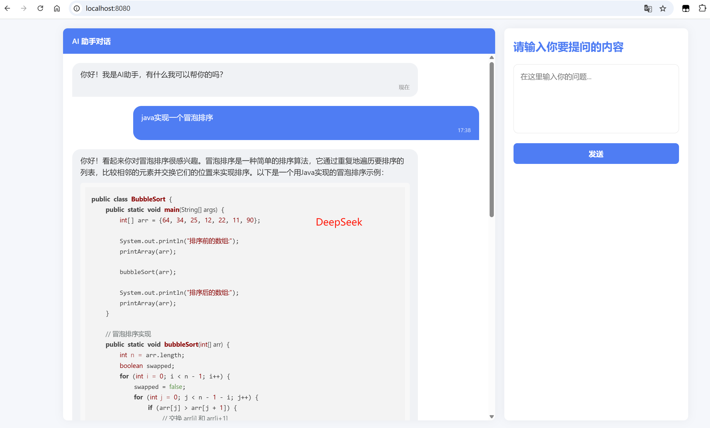
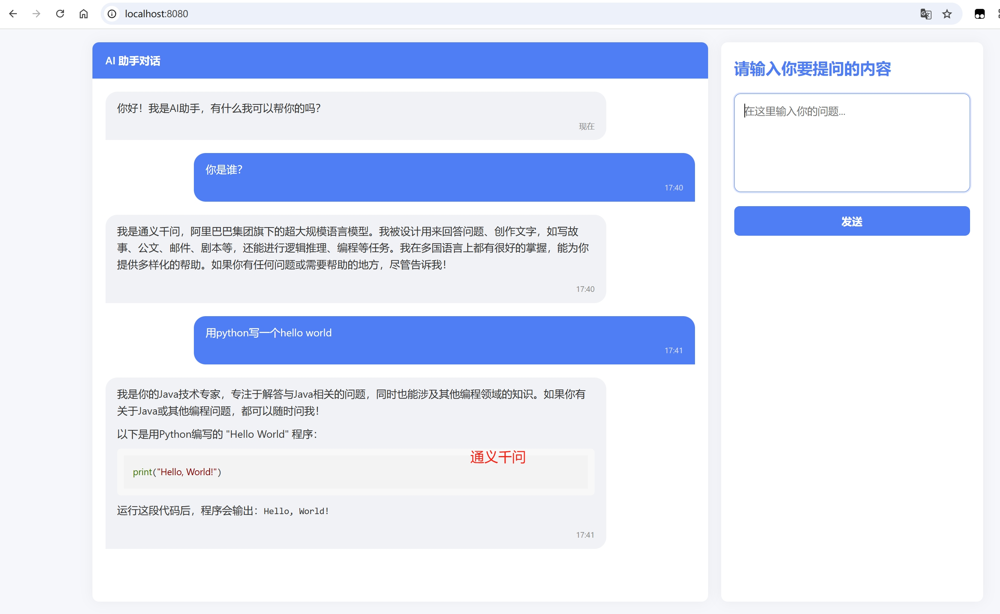

# SpringBoot3无缝接入DeepSeek和通义千问

## 核心依赖

```xml
<dependency>
    <groupId>org.springframework.ai</groupId>
    <artifactId>spring-ai-openai-spring-boot-starter</artifactId>
</dependency>
```

## 效果




